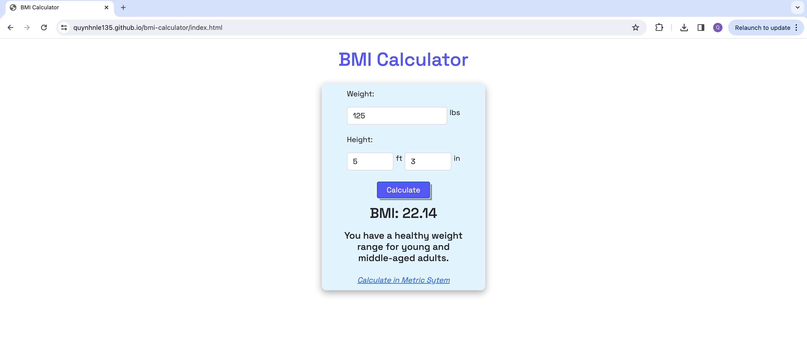

# BMI Calculator 

This is a simple yet powerful tool designed to help individuals calculate their Body Mass Index (BMI) using either the Metric or Standard measurement systems. This project is built using HTML, CSS, and JavaScript, focusing on creating an accessible, user-friendly interface that caters to a global audience.

You can view this BMI Calculator [here]()
## Features
- Dual Measurement Systems: Users can calculate their BMI using either:
    - The Metric System (kilograms and meters)
    - The Standard System (pounds and inches)
- User-Friendly Interface: Easy-to-use form for entering weight and height, with clear instructions.
- Instant Results: Dynamic calculation of BMI without the need to refresh the page.
- Responsive Design: The layout adjusts to fit various screen sizes, ensuring a seamless experience on desktops, tablets, and smartphones.

## Screenshots

#### Standard System

#### Metric System

